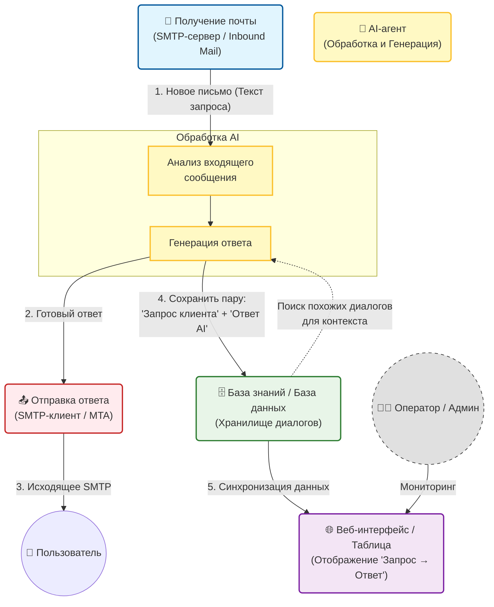

# 1. Идейная реализация решения

## Пользовательский путь

Интерфейс выполнен в стиле «рабочего стола» оператора поддержки. Слева — панель управления заявками, справа — рабочая область.

**Последовательность действий оператора:**

1. **Вход в систему** — оператор открывает веб-интерфейс и видит в левой панели список входящих обращений, отсортированных по времени или другому свойству.
2. **Выбор заявки** — оператор кликает на конкретное обращение (например, «Заявка №123 от client@mail.ru»).
3. **Анализ заявки** — в правой части экрана открывается окно чата с историей переписки. Над чатом отображается статус:
   - 🟡 *Нейросеть думает* — идёт первичный анализ письма;
   - 🟢 *Нейросеть ответила, всё ок* — сгенерирован черновик ответа, можно отправлять;
   - 🔴 *Нужна помощь человека* — низкая уверенность модели или высокая негативная тональность.
4. **Детальная информация** — оператор переключает вкладки в правой части:
   - *Статистика* — тональность письма, ключевые слова, извлечённые данные;
   - *Более подробная информация о клиенте*
5. **Работа с ответом** — оператор просматривает сгенерированный AI-ответ в чате, при необходимости редактирует его или дополняет, заадаёт дополнительные вопросы клиенту. Работа с клиентом переходит в ручной режим
6. **Завершение** — После удовлетворения заявки её статус переключается на "Завершено". Оператор возвращается в меню выбора заявок

# 2. Архитектура системы

### 1. Клиентская часть (Frontend)
- **React** — выбираем для создания интерфейса оператора поддержки, описанного в пользовательском пути. Позволит быстро реализовать нужную архитектуру и обеспечит синхронное обновление статусов заявок без перезагрузки страницы.

---

### 2. Серверная часть (Backend)
- **FastAPI** — идеально подходит для оркестрации между модулями нашей системы: приём писем от почтового модуля, вызов AI-агента для анализа тональности и генерации ответа, сохранение данных в БД и отправка обновлений на фронтенд через WebSocket. Асинхронность FastAPI позволит не блокировать запросы во время ожидания ответа от LLM.
- **REST API** — используем потому что это удобный и стандартизированный набор правил для создания API. С его помощью получается понятная структура эндпоинтов, и сервисам легко общаться между собой.

---

### 3. Слой работы с данными
- **PostgreSQL** — выбираем потому что это надежная реляционная база данных, которая отлично подходит для хранения структурированных данных: заявок, истории диалогов, статусов обработки и результатов анализа тональности. Благодаря расширению pgvector сможем хранить эмбеддинги прямо в той же базе, не поднимая отдельную векторную БД — это упростит инфраструктуру на хакатоне.
- **Pandas** — пригодит ся для пост-анализа эффективности AI-агента: рассчитаем метрики точности тональности, среднее время ответа, количество заявок, ушедших на ручную обработку (статус 🔴). В целом является очень удобным инструментом для структуризации и анализа данных

---

### 4. Внешние сервисы и интеграции

#### 🤖 **GroqCloud (LLM Inference)**
- **Роль в системе**: обеспечивает генерацию ответов клиентам на основе базы знаний. От выбора этой платформы напрямую зависит скорость работы AI-агента.
- **Почему GroqCloud**: нам критически важно, чтобы статус «Нейросеть думает» не затягивался — оператор не должен ждать ответа минутами. GroqCloud с их LPU-чипами даёт генерацию в десятки токенов в секунду, что позволит уложиться в комфортное время ожидания и сохранить UX на высоком уровне.

#### 📧 **SMTP-сервис**
- Используется для отправки сгенерированных ответов реальным клиентам. В нашей архитектуре это финальный шаг после того, как оператор подтвердил ответ в интерфейсе. Также может пригодиться для уведомления оператора о новых заявках.

---

### 5. Инфраструктура
- **Docker** — критически важен для хакатона: поднимем одной командой все компоненты (фронтенд, бэкенд, БД, Redis) на любом ноутбуке. Контейнеризация также изолирует сервисы друг от друга, что упрощает процесс отладки и развертывания.

## Схема взаимодействия компонентов:

# 3. Анализ рисков проекта

## 1. Низкая точность анализа писем

**Описание:**  
AI может некорректно определить категорию обращения, тональность или извлечь ключевые данные. Особенно это вероятно при сложных формулировках, длинных письмах или нескольких проблемах в одном сообщении. Ошибки на этом этапе приводят к неправильной генерации ответа и искажению данных в таблице.

**Пути решения:**  
- Использование предобученных моделей с хорошей базовой точностью.  
- Ограничение количества категорий в MVP.  
- Введение оценки уверенности (confidence score).  
- Автоматическая передача обращения оператору при низкой уверенности.  

---

## 2. Некорректная генерация ответов

**Описание:**  
Модель может «галлюцинировать» информацию, давать слишком общий ответ или использовать неподходящий тон. Это создает репутационные риски и снижает доверие клиентов.

**Пути решения:**  
- Генерация ответов только на основе базы знаний (RAG-подход).  
- Использование строгих шаблонов ответа.  
- Ограничение свободы генерации через системный промпт.  

---

## 3. Перегруженность сервисов и очереди запросов
- **Описание:** В пиковые моменты нагрузки может возникнуть ситуация, когда несколько заявок приходят одновременно. AI-агент будет обрабатывать их последовательно, запросы к GroqCloud встанут в очередь, фронтенд будет ждать ответа, скорость исполнения заявок уменьшится.
- **Минимизация:**
  - Внедрение очереди задач для асинхронной обработки заявок — пользователь сразу получает подтверждение, что заявка принята в работу.
  - Добавление таймаутов на запросы к внешним API, чтобы одна зависшая заявка не блокировала всю систему.
  - Отображение на фронтенде не только статуса «Думает», но и позиции в очереди, чтобы оператор понимал, что система не зависла, а просто загружена.

  - Ограничение количества одновременных запросов к AI (rate limiting) на уровне бэкенда.

